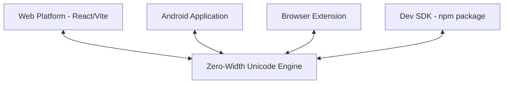

<div align="center">


# 🕵️ Emoji Smuggle
### **Stealthy Unicode Steganography & Cross-Platform Invisible Payload Platform**

*Hide compressed images, encrypted messages, and secret text inside innocent emoji strings.*

[](https://www.npmjs.com/package/emoji-smuggle)
[](https://opensource.org/licenses/Apache-2.0)
[](https://github.com/Subhan-Haider/EmojiSmuggle/pulls)
[](https://emoji.subhan.tech)

[**Explore the App**](https://emoji.subhan.tech) • [**Read the SDK Docs**](./emoji-smuggle/README.md) • [**API Reference**](https://emoji.subhan.tech/developers)

</div>

---

## ⚡ What is Emoji Smuggle?

Standard encrypted payloads stand out, raising suspicion immediately. **Emoji Smuggle** resolves this using advanced Unicode steganography. By leveraging hidden zero-width joiner characters (`\u200C` and `\u200D`), it embeds compressed, optionally encrypted binary payloads into plain-looking emojis.

To any observer, you are just sending standard emojis. To your recipient, it is a highly secure, private communication channel.

---

## 🌌 The Cross-Platform Ecosystem

Emoji Smuggle operates as a seamless cross-platform steganography ecosystem:



### 1. 🌐 Web Platform (`/`)
* **Cyberpunk Console:** Stunning high-fidelity interface with fluid Framer Motion animations.
* **Image Smuggling:** Encodes images (scaled with ultra-efficient client-side JPEG quantization) into emoji payloads.
* **Open API Platform:** Developers can trigger registration-free encoding/decoding API endpoints natively.

### 2. 📱 Android App (`/android`)
A fully-featured Kotlin & Jetpack Compose app featuring deep Android system-wide typing integrations:
* **📝 In-Place Context Menus:** Highlight text in *any* app (WhatsApp, Discord, Notes) and tap **"Encode with Emoji Smuggle"** or **"Decode with Emoji Smuggle"** to swap text instantly.
* **📋 Smart Clipboard Auto-Detect:** Detects copied stego payloads or normal text on focus and offers instant action pop-ups.
* **📤 Native Share Sheet Hooks:** Share texts/payloads directly to the app's translucent modal context sheets.
* **🕵️ Floating Bubble Overlay:** An optional draggable overlay service running as a foreground bubble for instant access over any application.

### 3. 🔌 Chrome/Edge Extension (`/browser-extension`)
* Adds simple browser context-menu listeners.
* Select, right-click, and click **"Encode Highlighted Text"** or **"Decode Emojis"** to smuggle secrets in real-time.

### 4. 📦 Developer npm SDK (`/emoji-smuggle`)
A lightweight, zero-dependency, production-ready steganography engine for Javascript/Typescript backends or web frontends.

---

## 💻 Developer Quick Start with SDK

Install the package:
```bash
npm install emoji-smuggle-sdk
```

### Basic Steganography
```javascript
import { encodeMessage, decodeMessage } from 'emoji-smuggle-sdk';

// Encode a secret
const msg = encodeMessage("Meet at dawn 🌅", { carrier: 'cyberpunk' });
console.log(msg); // 🕵️​‌‌​‌​​​‌​‌​​‌​​‌​‌​​‌‌​‌​​‌‌​​‌📦

// Decode the secret back
const secret = decodeMessage(msg);
console.log(secret); // Meet at dawn 🌅
```

### Password Protection (AES-256)
To secure the payload with custom encryption keys:
```javascript
const encrypted = encodeMessage("Top Secret Agent Data", {
  password: "super_secure_key",
  carrier: 'ghost'
});

const decrypted = decodeMessage(encrypted, "super_secure_key");
```

---

## 🛠️ Project Structure & Setup

### Repository Layout
```
├── android/             # Android Kotlin / Compose Native App
├── browser-extension/   # Chrome/Edge Manifest V3 Web Extension
├── emoji-smuggle/       # The npm SDK package source
├── src/                 # React & Vite Main Platform source
└── public/              # Global static assets
```

### Web App Installation
1. Install dependencies:
   ```bash
   npm install
   ```
2. Run development server:
   ```bash
   npm run dev
   ```
3. Build for production:
   ```bash
   npm run build
   ```

---

## 📱 Compiling & Signing the Android App

To build and run the native Android app:

### 1. Simple PowerShell Builds
We have included portable, pre-configured PowerShell scripts in the root directory that automatically bind the included JDK 17 and compile the binaries:
* **Debug APK Build:** Run `.\build_android.ps1` in PowerShell.
* **Release AAB & APK Build:** Run `.\build_android_release.ps1` in PowerShell.

The finalized release files will be generated directly in the project's root folder:
* `EmojiSmuggle-release-v5.aab` (Google Play bundle)
* `EmojiSmuggle-release-v5.apk` (Direct installable APK)

### 2. Manual Command Line Build
To manually build using Gradle, ensure the JVM home in `android/gradle.properties` matches the compatible JDK 17 (major version 61) to avoid major-version exceptions:
```properties
org.gradle.java.home=c:/Users/setup/Videos/WEBSITES FOR CHANGES/emog/temp_jdk/jdk-17.0.19+10
```

Then compile the release bundle and package via:
```bash
cd android
.\gradlew.bat bundleRelease assembleRelease
```

### 🔑 Release Signing Credentials
The production packages are signed automatically during the build process using the local Java keystore file:

| Parameter | Value |
| :--- | :--- |
| **Keystore File** | `release-key.jks` (located inside [android/app/](file:///c:/Users/setup/Videos/WEBSITES%20FOR%20CHANGES/emog/android/app/release-key.jks)) |
| **Keystore Password** | `password123` |
| **Key Alias** | `emojismuggle` |
| **Key Password** | `password123` |

---

## 🔌 Installing the Browser Extension

1. Open Chrome/Edge and go to `chrome://extensions/`.
2. Toggle on **Developer mode** in the top right corner.
3. Click **Load unpacked** in the top left corner.
4. Select the `/browser-extension` directory inside this repository.

---

## 📡 Free-Tier Open API

Our public stego API has absolute zero-barrier, requires no authentication headers, and does not record client logs:

#### Encode Plain Text
```bash
curl -X POST https://api.emoji.subhan.tech/v1/encode \
  -H "Content-Type: application/json" \
  -d '{"payload": "Top secret target", "carrier": "random"}'
```

#### Decode Emojis
```bash
curl -X POST https://api.emoji.subhan.tech/v1/decode \
  -H "Content-Type: application/json" \
  -d '{"encoded": "🕵️​‌‌​‌​​​‌​‌​​‌​​‌​‌​​‌‌​‌​​‌‌​​‌📦"}'
```

---

<div align="center">

### Built with ⚡ by [Subhan Haider](https://github.com/Subhan-Haider)

*Transforming innocent emojis into secure, invisible data carriers.*

</div>
